# \<codit\> Quiz
(Developer: Valentino Braga)

\<codit\> Your JavaScript Quiz is a simple quiz designed for newbies in software development. The game has 10 questions for each new entry and by the end, you can see how many questions you got right. This project's goal is to help new developers not only to test their knowledge but also to learn more about JS in a fun and interactive way.

[Live Website](https://tinobragaa.github.io/codit-quiz/)

# Table of Contents

- [\<codit\> Quiz](#--codit---quiz)
- [Table of Contents](#table-of-contents)
- [User Experience (UX)](#user-experience--ux-)
  * [Business Goals](#business-goals)
    + [User Goals](#user-goals)
    + [Website Owner Goals](#website-owner-goals)
    + [Target Audience](#target-audience)
    + [User Expectations](#user-expectations)
  * [User Stories](#user-stories)
    + [First-Time User](#first-time-user)
    + [Returning User](#returning-user)
    + [Site Owner](#site-owner)
- [Design](#design)
  * [Wireframes](#wireframes)
  * [Typography](#typography)
  * [Colour Palette](#colour-palette)
  * [Structure](#structure)
- [Features](#features)
    + [Main Page](#main-page)
    + [Quiz - Welcome Interface](#quiz---welcome-interface)
    + [Quiz - Rules Interface](#quiz---rules-interface)
    + [Quiz - Game Interface](#quiz---game-interface)
    + [Quiz - Score Interface](#quiz---score-interface)
    + [Quiz - Scoreboard Interface](#quiz---scoreboard-interface)
    + [404 Error Page](#404-error-page)
- [Future Features](#future-features)
- [Technologies Used](#technologies-used)
    + [Languages](#languages)
    + [Resources and Tools](#resources-and-tools)
- [Testing Cases](#testing-cases)
    + [User Stories](#user-stories-1)
    + [Features and Validation](#features-and-validation)
- [Validation](#validation)
    + [HTML Validation](#html-validation)
    + [CSS Validation](#css-validation)
    + [JS Validation](#js-validation)
    + [Lighthouse](#lighthouse)
    + [Accessibility](#accessibility)
- [Bugs](#bugs)
- [Deployment](#deployment)
    + [Deploy](#deploy)
    + [Fork](#fork)
    + [Clone](#clone)
- [Credits](#credits)
- [Acknowledgements](#acknowledgements)

# User Experience (UX)

## Business Goals

### User Goals
- Find an interactive way to learn
- Clear rules and easy access to it
- Possibility to restart the game
- See if their answer is right or wrong
- Access to their score
- Different questions for new entries

### Website Owner Goals
- Deliver easy-to-read quizzes to test user's knowledge
- Provide a range of questions to increase the dynamic
- To provide a fully responsive quiz that can be played on a range of devices

### Target Audience
- New software developers
- Coding students
- Programming professionals in general

### User Expectations
- Smooth and playable quiz
- Appealing design
- Accessibility

## User Stories

### First-Time User
1. As a first-time user, I want to understand the rules
2. As a first-time user, I want to see if my answer is correct or incorrect
3. As a first-time user, I want to be able to restart the quiz

### Returning User
1. As a returning user, I want to different questions
2. As a returning user, I want to improve my knowledge of JS
3. As a returning user, I want to have fun in a well designed game

### Site Owner
1. As a site owner, I want users to easily understand my project
2. As a site owner, I want users to enjoy and learn at the same time
3. As a site owner, I want ways to have an easy and good experience throughout the quiz

# Design

The website's quiz is designed in four continuous interfaces to enable the user to have a smooth and intuitive experience. The priorities of the \<codit\> are to give an organized and effortless design throughout the quiz, the ability to test the user's expertise and the possibility of ongoing learning through random and different questions each time.

The concept behind this project is a minimalist, futuristic and tech kind of vibe. This is reflected in the logo font that resembles coding-fonts design, in the straightforward colour palette (black, white and JS yellow) and consistent design through the interfaces, buttons and the error page, aiming for a positive user experience.

## Wireframes

The initial concept of the design can be seen here and they were made through the Balsamiq wireframing software.

Start Interface Wireframe

 

Rules Interface Wireframe

 

Quiz Interface Wireframe

 

Score Interface Wareframe

 

404 Error Page Wareframe

 

## Typography

Overpass Mono and Press Start 2P fonts were chosen from Google Fonts. Fonts were selected to represent the clear, minimalist and "coding" feel they inspire in the user.

## Colour Palette

The colour chosen was: white (#ffffff), JS yellow (#F9DD3C) and GitHub grey-black (#1E1E1E). The colours were tested on Webaim using their contrast checker and the ratio was higher than 12.25:1 meaning that they are a great fit. 

The yellow colour is inspired by the JavaScript main colour logo and the grey-black is inspired by the background colour of the GitHub dark mode.

## Structure 

To keep the user interface as easy and smooth as possible I choose 4 game areas that are continuously played and the 404 Error Page. 

- Start Area: The first interface is the start area where the user is greeted and asked about their name.
- Rules Area: The second interface showcase the quiz rules and call the user by their name.
- Quiz Area: The third interface is where the questions and answers are displayed. 
- Score Area: The fourth interface gives users their score and the possibility to restart the quiz.
- Error 404 Page: The Error page is created for broken links with a button to return to the game. 

# Features

The website contains 2 pages: quiz page with 4 interfaces and 404 page. 

### Main Page
- Logo, home link with hover effect. 
- Big title defining the purpose of the website.
- Quiz container.
- Sticky footer bar with social media links and hover effect.

Main Page

 

Logo Link Hover Effect

 

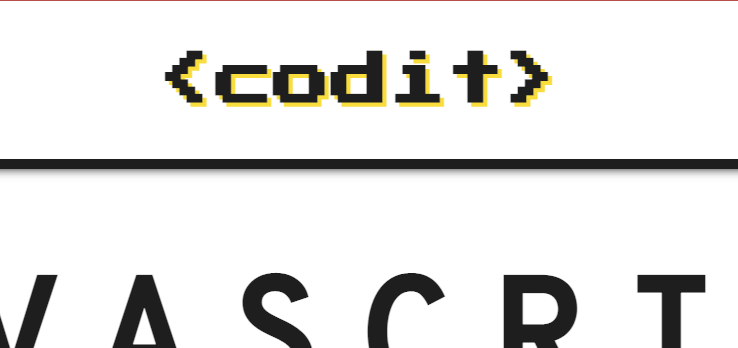

Quiz Container and Title

 

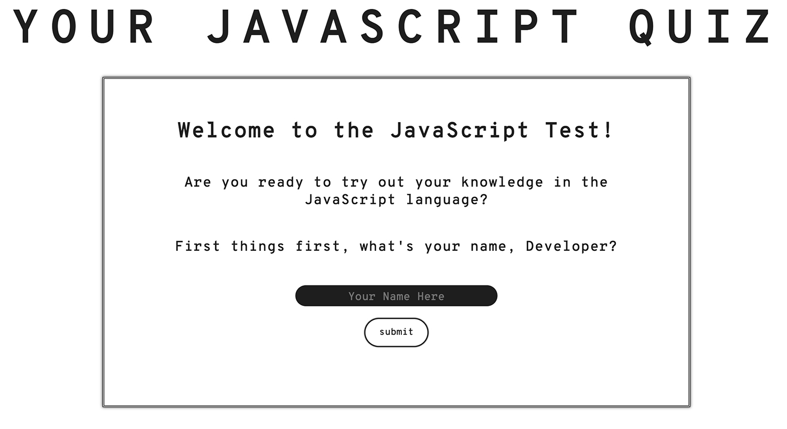

Sticky Footer - Social Media Links

 

Social Media Links Hover Effect

 

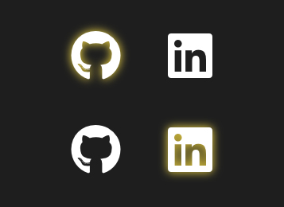

### Quiz - Welcome Interface
- JavaScript hover effect.
- Call to action to play the quiz.
- User's name request.
- Input hover effect.
- Button hover effect.
- Input validation: 3-10 letters and no numbers.

Welcome Interface

 

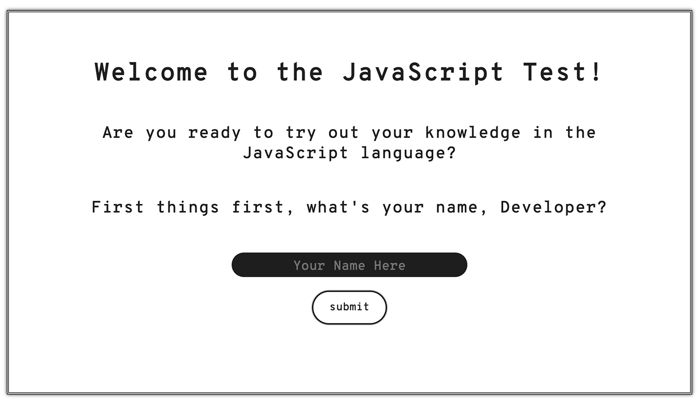

JavaScript Text Hover Effect

 

Input Hover Effect

 

Input Validation

 

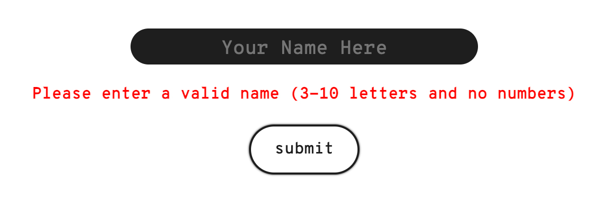

Submit Button Hover Effect

 

### Quiz - Rules Interface
- Maintain default design: logo, big title, container style, button style and footer. Concise design.
- User's name reuse.
- Start Quiz button hover effect.

Rules Interface

 

User Name Reuse

 

Start Quiz Button Hover Effect

 

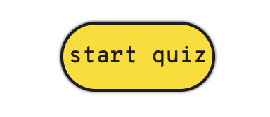

### Quiz - Game Interface
- Maintain default design: logo, big title, container style and footer. Concise design.
- Score box to keep track of the right answer.
- 30 seconds timer for each question.
- Question counter to know which question the user is currently on.
- Green response for correct answers.
- Red response for incorrect answers.
- If the time is over and there is no option selected, all answer options turn to red and the buttons are disabled. 

Game Interface

 

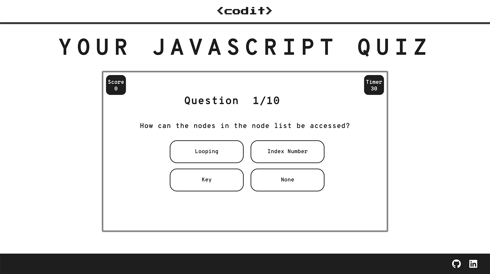

Score Box

 

Question Counter

 

Timer

 

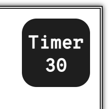

Correct Answer

 

Incorrect Answer

 

No Answer

 

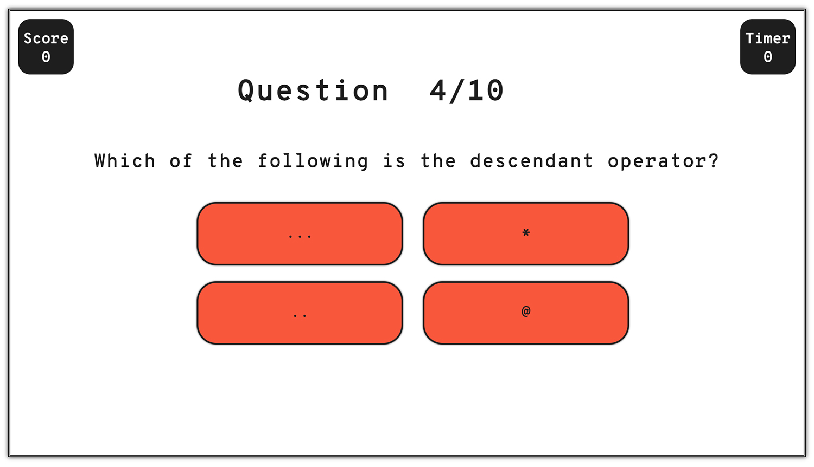

### Quiz - Score Interface
- Maintain default design: logo, big title, container style, button style and footer. Concise design.
- Showcase the user's name.
- Showcase the user's final score.
- Restart button hover effect.

Score Interface

 

User's Name

 

User's Final Score

 

Start-Again/Save-Score Buttons Hover Effect

 

### Quiz - Scoreboard Interface
- Show the last 5 scores alongside the user's name.
- Button to restart the game.

Scoreboard Interface

 

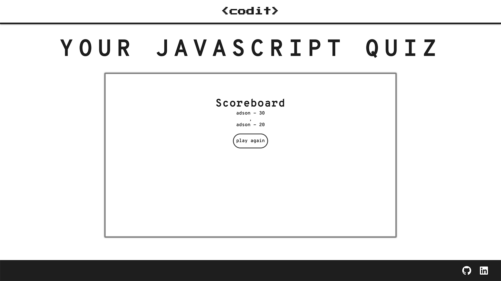

Play Again Button Hover Effect

 

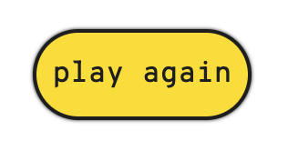

### 404 Error Page
- Maintain default design: logo, big title, container style, button style and footer. Concise design.
- Back to quiz button hover effect.

404 Error Page

 

Quiz Button

 

# Future Features

A few features that could make the website even better are listed here:

1. Implement different difficulty levels for the questions, such as easy, medium, and hard.

2. Add a multiplayer mode where users can compete against each other.

3. Include the option to share quiz results on social media.

4. Connect an API to enable dynamic question updates and enhance versatility.

# Technologies Used

### Languages
The following languages were used to develop the website:
- HTML
- CSS
- JavaScript

### Resources and Tools
The following resources and tools were used to develop the website:
- Git
- Github
- Gitpod
- Favicon
- DevTools
- Balsamiq
- W3 Schools
- Codecademy
- Google Fonts
- Font Awesome
- Stack Overflow
- Tables Generator
- JSHint Validation
- Adobe Photoshop 2023
- Techsini Mockup Generator
- GitHub Wiki TOC generator
- W3C Markup Validation Service

# Testing Cases

### User Stories

| User Story                                                                            | Feature                                                                                                                    | **Achieved** |
|---------------------------------------------------------------------------------------|----------------------------------------------------------------------------------------------------------------------------|--------------|
| As a first-time user, I want to understand the rules.                                 | Rules are explained intuitively throughout the quiz.                                                                       | Yes.         |
| As a first-time user, I want to see if my answer is correct or incorrect.             | Positive/Negative feedback from selecting correct/wrong options and not selecting any.                                     | Yes.         |
| As a first-time user, I want to be able to restart the quiz.                          | In the end, you are able to start the quiz and answer more and different questions.                                        | Yes.         |
| As a returning user, I want to different questions.                                   | The quiz has 65 questions that are randomized for a unique experience.                                                     | Yes.         |
| As a returning user, I want to improve my knowledge of JS.                            | There are a great number of questions in different aspects of JavaScript and at different levels.                          | Yes.         |
| As a returning user, I want to have fun in a well designed game.                      | The site design is concise and has a minimalist feel in the way is displayed. A mix of tons of black, white and JS yellow. | Yes.         |
| As a site owner, I want users to easily understand my project.                        | Rules are explained intuitively throughout the quiz.                                                                       | Yes.         |
| As a site owner, I want users to enjoy and learn at the same time.                    | There are a great number of questions in different aspects of JavaScript and at different levels.                          | Yes.         |
| As a site owner, I want ways to have an easy and good experience throughout the quiz. | The site design is concise and has a minimalist feel in the way is displayed. A mix of tons of black, white and JS yellow. | Yes.         |

### Features and Validation

 Thorough testing of this quiz has been undertaken to ensure that all of the buttons and functionality of the quiz work exactly as they have been intended to.
 - Main Page

| **Feature**                      | **Expectation**                                                             | **Action**                       | **Result**                                                                  |
|----------------------------------|-----------------------------------------------------------------------------|----------------------------------|-----------------------------------------------------------------------------|
| Logo home link.                  | When clicked, the user is taken to the Home page.                           | Click the logo.                  | When clicked, the user is taken to the Home page.                           |
| Logo hover effect.               | When hovered, a shadow appears under the logo to indicate a link.           | Hovered the mouse over the logo.     | When hovered, a shadow appears under the logo to indicate a link.           |
| Sticky footer.                   | The footer bar is glued to the bottom of the window at every screen height. | Different device's width/height. | The footer bar is glued to the bottom of the window at every screen height. |
| Social media links.              | When clicked, the user is taken to the LinkedIn or GitHub site.             | Click the icons.                 | When clicked, the user is taken to the LinkedIn or GitHub site.             |
| Social media links hover effect. | When hovered, a shadow appears under the icons to indicate a link.          | Hovered the mouse over the icons.    | When hovered, a shadow appears under the icons to indicate a link.          |

 - Welcome Interface

| **Feature**                 | **Expectation**                                                      | **Action**                                 | **Result**                                                           |
|-----------------------------|----------------------------------------------------------------------|--------------------------------------------|----------------------------------------------------------------------|
| JS hover effect.            | When hovered, the "JavaScript" word color changes to yellow.         | Hovered the mouse over the word.                            | When hovered, the "JavaScript" word color changes to yellow.         |
| Input hover effect.         | When hovered, the input border color change to indicate a link.      | Hovered the mouse over input.              | When hovered, the input border color change to indicate a link.      |
| Input validation.           | Invalid input: empty, white spaces, numbers, > 3 or < 10.            | Invalid input. | Invalid input: empty, white spaces, numbers, > 3 or < 10.            |
| Submit button.              | When clicked, loads the next interface ( rules interface).           | Click the button.                            | When clicked, loads the next interface ( rules interface).           |
| Submit button hover effect. | When hovered, the button background color change to indicate a link. | Hovered the mouse over the answer button.  | When hovered, the button background color change to indicate a link. |

 - Rules Interface

| **Feature**                     | **Expectation**                                                                                | **Action**                    | **Result**                                                                                     |
|---------------------------------|------------------------------------------------------------------------------------------------|-------------------------------|------------------------------------------------------------------------------------------------|
| User name reuse.                | After the user name was taken from the welcome interface, use it again on the rules interface. | N/A                           | After the user name was taken from the welcome interface, use it again on the rules interface. |
| Start quiz button.              | When clicked, loads the next interface (quiz interface).                                | Click the button.                       | When clicked, loads the next interface (quiz interface).                                |
| Start quiz button hover effect. | When hovered, the button background color change to indicate a link.                           | Hovered the mouse over input. | When hovered, the button background color change to indicate a link.                           |

 - Quiz Interface

| **Feature**              | **Expectation**                                                                                                                                                                            | **Action**                                 | **Result**                                                                                                                                                                                 |
|--------------------------|--------------------------------------------------------------------------------------------------------------------------------------------------------------------------------------------|--------------------------------------------|--------------------------------------------------------------------------------------------------------------------------------------------------------------------------------------------|
| Answer buttons.          | All answer buttons have a hover effect during the 30s of the timer. When the timer reaches 0, the hover effect and ability to click the buttons are disabled.                              | Hovered the mouse over the answer buttons. | All answer buttons have a hover effect during the 30s of the timer. When the timer reaches 0, the hover effect and ability to click the buttons are disabled.                              |
| Correct answer.          | When clicking on the correct answer, the button background color change to green to indicate the correct answer.                                                                           | Click the correct answer button.                     | When clicking on the correct answer, the button background color change to green to indicate the correct answer.                                                                           |
| Wrong answer.            | When clicking on the wrong answer, the button background color change to red to indicate the wrong answer.                                                                                 | Click the wrong answer button.                     | When clicking on the wrong answer, the button background color change to red to indicate the wrong answer.                                                                                 |
| No answer.               | When there is no answer and the time's over, all button's background color turn to red.                                                                                                    | N/A                                        | When there is no answer and the time's over, all button's background color turn to red.                                                                                                    |
| Score box.               | The score counter starts at 0. If the user gets the question correct, the score increases by 10 + and the timer stops.                                                                     | Click the correct answer button.            | The score counter starts at 0. If the user gets the question correct, the score increases by 10 + and the timer stops.                                                                     |
| Question counter.        | The question counter will show 1/10. This increments each time a new question is displayed. After the question counter reaches 10/10, the quiz ends.                                       | Quiz played until the end.                 | The question counter will show 1/10. This increments each time a new question is displayed. After the question counter reaches 10/10, the quiz ends.                                       |
| Timer box.               | The timer is set to 30s and begins counting down immediately. When it reaches 0, the answer buttons and hover effect are disabled and the button's background color turns to red.          | N/A                                        | The timer is set to 30s and begins counting down immediately. When it reaches 0, the answer buttons and hover effect are disabled and the button's background color turns to red.          |
| Next question countdown. | When there is an answer or the time reaches 0 and there is no answer, there's a timeout of 1.2s and the next question is displayed. If it's the last question, it loads the next interface | N/A                                        | When there is an answer or the time reaches 0 and there is no answer, there's a timeout of 1.2s and the next question is displayed. If it's the last question, it loads the next interface |

 - Score Interface

| **Feature**                      | **Expectation**                                                                                                                          | **Action**                         | **Result**                                                                                                                               |
|----------------------------------|------------------------------------------------------------------------------------------------------------------------------------------|------------------------------------|------------------------------------------------------------------------------------------------------------------------------------------|
| User name reuse.                 | After the user name was taken from the welcome interface, use it again on the score interface.                                           | N/A                                | After the user name was taken from the welcome interface, use it again on the score interface.                                           |
| Score display.                   | The score show on the score interface.                                                                                                   | N/A                                | The score show on the score interface.                                                                                                   |
| Start again button.              | When clicked, the quiz restarts.                                                                                                         | Click the button.                  | When clicked, the quiz restarts.                                                                                                         |
| Start again button hover effect. | When hovered, the button background color change to indicate a link.                                                                     | Hovered the mouse over the button. | When hovered, the button background color change to indicate a link.                                                                     |
| Save score button.               | When clicked, the score is saved with the user name, it is displayed at the scoreboard interface and the scoreboard interface is loaded. | Click the button.                  | When clicked, the score is saved with the user name, it is displayed at the scoreboard interface and the scoreboard interface is loaded. |
| Save score button hover effect.  | When hovered, the button background color change to indicate a link.                                                                     | Hovered the mouse over the button. | When hovered, the button background color change to indicate a link.                                                                     |

 - Scoreboard Interface

| **Feature**                     | **Expectation**                                                                                      | **Action**                         | **Result**                                                                                           |
|---------------------------------|------------------------------------------------------------------------------------------------------|------------------------------------|------------------------------------------------------------------------------------------------------|
| Scoreboard displayed.           | After you save your score and name, the scoreboard is displayed showing the last 5 scores and names. | N/A                                | After you save your score and name, the scoreboard is displayed showing the last 5 scores and names. |
| Play again button.              | When clicked, the quiz restarts.                                                                     | Click the button.                  | When clicked, the quiz restarts.                                                                     |
| Play again button hover effect. | When hovered, the button background color change to indicate a link.                                 | Hovered the mouse over the button. | When hovered, the button background color change to indicate a link.                                 |

 - 404 Error Page

| **Feature**               | **Expectation**                                                      | **Action**                         | **Result**                                                           |
|---------------------------|----------------------------------------------------------------------|------------------------------------|----------------------------------------------------------------------|
| Quiz button.              | When clicked, it takes back to the quiz.                             | Click the button.                  | When clicked, it takes back to the quiz.                             |
| Quiz button hover effect. | When hovered, the button background color change to indicate a link. | Hovered the mouse over the button. | When hovered, the button background color change to indicate a link. |

# Validation

### HTML Validation

The Nu HTML Checker (W3C) is used to validate HTML documents. The files passed without any errors.

index HTML Validation

 

404 Error HTML Validation

 

### CSS Validation

The W3C Jigsaw CSS Validation Service is used to validate CSS documents. The file passed without any errors.

CSS Validation

 

### JS Validation

The JSHint is used to validate JavaScript documents. The files passed without any errors.

Main JS Validation

 

Questions JS Validation

 

### Lighthouse

Lighthouse testing was carried out to test the performance, accessibility, best practices and SEO of the quiz.

index HTML Lighthouse

 

404 Error HTML Validation

 

### Accessibility

The WAVE web accessibility evaluation tool by WebAIM was used to ensure the webpages met accessibility standards.

index HTML WAVE

 

404 Error HTML Validation

 

Responsive test on multiple devices.
The following devices were used to ensure the site was responsive:

- Ipad Pro
- Galaxy S20
- Macbook Pro
- Iphone 13 Pro
- Iphone 14 Pro Max
- Notebook Acer Predator Helios 300

# Bugs

Bug: When I wrote the function "getUserName" I couldn't make it work. What I wanted it to do was to take the asked user name in the first interface and use it on the second interface. The problem was that it wasn't showing the value inside the ${}, when the function loaded the inner text was displayed but not the content inside the curly braces.
 
Fix: The solution was the type of event used in the first place. In the HTML file, I was using onclick event which was preventing the function to work like needed. The appropriate event is the onblur: it triggers the function once the field loses focus (i.e. the user navigates away from the field).

Bug: Change the background colour of the input type text when auto-filling from the browser.
 
Fix: I was able to achieve that using the "-WebKit-autofill" so whenever the user fills the input field with the browser auto-filling it doesn't change its colour.

Bug: When I tried the quiz on my phone the hover effects were sticky to the buttons. The background colour that was set through the hover effect wouldn't disappear on the touchscreen capabilities.
 
Fix: Added media queries to disable the hover effect on touchscreen devices.

Bug: When I tried the quiz on my phone the text inside the buttons inherit the default colour. I was expecting it to be black but it was coming along blue.
 
Fix: On the CSS part I defined the colour to prevent inheriting it from the default. 

Bug: I didn't want the label element appearing on the site. However, the wave validation keeps tracking it as an error.
 
Fix: Reading through the wave website, the appropriate way to do it is using a class .visuallyhidden.

Bug: The "required" attribute wasn't working on the user's name input in the welcome interface. 
 
Fix: This attribute only works inside form elements. I was able to achieve the same result with JavaScript functions (prevent the user to proceed without filling in the input).

# Deployment

[Click Here To See The Live Website](https://tinobragaa.github.io/codit-quiz/)

### Deploy
The website was deployed through the use of GitHub Pages, a feature built in to GitHub. This can be done by following the steps below.
1. In the desired repository, click on "Settings" from the top menu.
2. From the side menu to your left, select "Pages" in the "Code and automation" section.
3. Make sure the "Source" option is set to "Deploy from a branch"
4. Select the desired "Branch" from the drop down below (main branch in most cases, making sure the director is set to /(root)).
5. Select "Save", and after it refreshes the page, you will see a box at the top of the page providing you with the URL of your now published site.

To contribute or check the code yourself, you can fork or clone the repository as well.

### Fork
1. Go to the desired repository
2. Click "Fork" in the upper right corner
3. Select the owner, and set the repository name. A description can be added if desired
4. Choose whether to copy the default branch, or all branches
5. Click "Create Form"

### Clone

1. Go to the desired repository
2. Click the "Code" button at the top of the files section of the page
3. Select your desired method for cloning (HTTPS/SSH/GitHub CLI)
4. Open Git Bash
5. Change the current working directory to the location where you want the cloned directory
6. Type "git clone", and then paste the URL you copied earlier. It will look like this, with your GitHub username instead of "YOUR-USERNAME": "$ git clone https://github.com/YOUR-USERNAME/DESIRED-REPOSITORY"
7. Press Enter. Your local clone will be created.

# Credits

A list of references and tutorials used for the site:

* [Quiz Questions](https://codescracker.com/index.htm)
* [Hiding Label Element](https://www.w3.org/WAI/tutorials/forms/labels/)
* [Input Required](https://www.w3schools.com/tags/att_input_required.asp)
* [Get Input's Value](https://www.tabnine.com/academy/javascript/get-value-of-input/)
* [Enable/Disable Button Tutorial](https://stackdiary.com/enable-disable-button-javascript/)
* [JavaScrip Timer](https://stackoverflow.com/questions/44314897/javascript-timer-for-a-quiz)
* [Quiz Tutorial](https://www.youtube.com/watch?v=u98ROZjBWy8&list=PLDlWc9AfQBfZIkdVaOQXi1tizJeNJipEx)
* [Hover Effect Mobile Devices](http://www.javascriptkit.com/dhtmltutors/sticky-hover-issue-solutions.shtml)
* [Quiz Tutorial](https://www.codeexplained.dev/2018/10/create-multiple-choice-quiz-using-javascript.html?m=1)
* [Timer Countdown](https://stackoverflow.com/questions/31106189/create-a-simple-10-second-countdown/31106229#31106229)
* [Behance/Cobyte](https://www.behance.net/gallery/129975245/Cobyte-brand-identity?tracking_source=search_projects%7Ccoding+design)
* [Browser Input Text Autofill](https://stackoverflow.com/questions/29580704/change-input-background-to-transparent-on-autocomplete-form)
* Love Maths Project

# Acknowledgements

I would like to take this opportunity to acknowledge and thank the following people:

- A big thank you for everybody on Code Institute's Slack Channels.
- Jason, tutor from Code Institue. Thank you for the help.
- My sister, Dana Braga, who's always willing to help.
- My loved husband, Adson Aquino, who's always by my side.