# \<codit\> Quiz
(Developer: Valentino Braga)

\<codit\> Your JavaScript Quiz, is a simple quiz designed for newbies in software development. The game has 10 questions for each new entry and by the end, you can see how many questions you got right. This project's goal is to help new developers not only to test their knowledge but also to learn more about JS in a fun and interactive way.

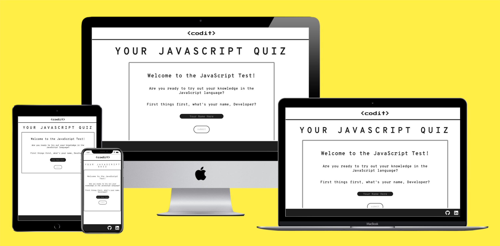

[Live Website](https://tinobragaa.github.io/codit-quiz/)

# Table of Contents

- [\<codit\> Quiz](#--codit---quiz)
- [Table of Contents](#table-of-contents)
- [User Experience (UX)](#user-experience--ux-)
  * [Business Goals](#business-goals)
    + [User Goals](#user-goals)
    + [Website Owner Goals](#website-owner-goals)
    + [Target Audience](#target-audience)
    + [User Expectations](#user-expectations)
  * [User Stories](#user-stories)
    + [First-Time User](#first-time-user)
    + [Returning Userå](#returning-user-)
    + [Site Owner](#site-owner)
- [Design](#design)
  * [Wireframes](#wireframes)
  * [Typography](#typography)
  * [Colour Palette](#colour-palette)
  * [Structure](#structure)
- [Features](#features)
    + [Quiz - Start Interface](#quiz---start-interface)
    + [Quiz - Rules Interface](#quiz---rules-interface)
    + [Quiz - Game Interface](#quiz---game-interface)
    + [Quiz - Score Interface](#quiz---score-interface)
    + [404 Error Page](#404-error-page)
- [Technologies Used](#technologies-used)
    + [Languages](#languages)
    + [Frameworks and Tools](#frameworks-and-tools)
- [Testing](#testing)
    + [HTML Validation](#html-validation)
    + [CSS Validation](#css-validation)
    + [JS Validation](#js-validation)
    + [Lighthouse](#lighthouse)
    + [Accessibility](#accessibility)
- [Bugs](#bugs)
- [Deployment](#deployment)
    + [Deploy](#deploy)
    + [Fork](#fork)
    + [Clone](#clone)
- [Credits](#credits)
- [Acknowledgements](#acknowledgements)

# User Experience (UX)

## Business Goals

### User Goals
- Find an interactive way to learn
- Clear rules and easy access to it
- Possibility to restart the game
- See if their answer is right or wrong
- Access to their score
- Different questions for new entries

### Website Owner Goals
- Deliver easy-to-read quizzes to test user's knowledge
- Provide a range of questions to increase the dynamic
- To provide a fully responsive quiz that can be played on a range of devices

### Target Audience
- New software developers
- Coding students
- Programming professional's in general

### User Expectations
- Smooth and playable quiz
- Appealing design
- Accessibility

## User Stories

### First-Time User
1. As a first-time user, I want to understand the rules
2. As a first-time user, I want to see if my answer is correct or incorrect
3. As a first-time user, I want to be able to restart the quiz

### Returning Userå
1. As a returning user, I want to different questions
2. As a returning user, I want to improve my knowledge of JS
3. As a returning user, I want to have fun in a well designed game

### Site Owner
1. As a site owner, I want users to easily understand my project
2. As a site owner, I want users to enjoy and learn at the same time
3. As a site owner, I want ways to have an easy and good experience throughout the quiz

# Design

The website's quiz is designed in four continuous interfaces to enable the user to have a smooth and intuitive experience. The priorities of the \<codit\> are to give an organized and effortless design throughout the quiz, the ability to test the user's expertise and the possibility of continuously learn through random and different questions each time.

The concept behind this project is a minimalist, futuristic and tech kind of vibe. Which is reflected in the logo font that resembles coding-fonts design, in the straightforward colour palette (black, white and JS yellow) and consistent design through the interfaces, buttons and the error page, aiming a positive user experience.

## Wireframes

The initial concept of the design can be seen here and they were made through the Balsamiq wireframing software.

Start Interface Wireframe

 

Rules Interface Wireframe

 

Quiz Interface Wireframe

 

Score Interface Wareframe

 

404 Error Page Wareframe

 

## Typography

Overpass Mono and Press Start 2P fonts were chosen from Google Fonts. Fonts were selected to represent clear, minimalist and "coding" feel they inspire in the user.

## Colour Palette

The colour chosen were: white (#ffffff), JS yellow (#F9DD3C) and github grey-black (#1E1E1E). The colours were tested on Webaim using their contrast checker and the ratio was higher than 12.25:1 meaning that they are a great fit. 

The yellow color is inspired in the JavaScript main color logo and the grey-black is inspired in the background color of the github dark mode.

## Structure 

To keep the user interface as easy and smooth as possible I choose 4 game areas continously played and the 404 Error Page. 

- Start Area: The first interface is the start area where the user is greeted and asked about their name.
- Rules Area: The second interface showcase the quiz rules and call the user by their name.
- Quiz Area: The third interface is where the questions and answers are displayed. 
- Score Area: The fourth interface gives users their score and the possibility to restart the quiz.
- Error 404 Page: The Error page is created for broken links with a button to return to the game. 

# Features

The website contains 2 pages: quiz page with 4 interfaces and 404 page. 

### Quiz - Start Interface
- Logo, Quiz Name.
- Big title defining the purpose of the website.
- Quiz container.
- JavaScript hover effect.
- Input hover effect.
- Button hover effect.
- Sticky footer bar with links.

Quiz - Start Interface

 

JavaScript Text Hover Effect

 

Input Hover Effect

 

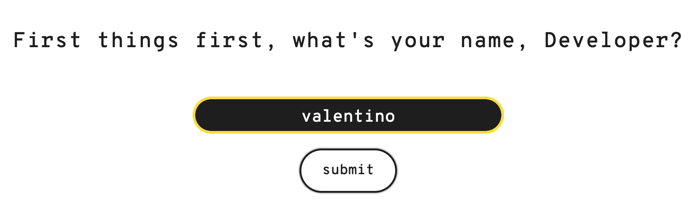

Submit Button Hover Effect

 

Sticky Footer - Social Media Links

 

### Quiz - Rules Interface
- Maintain default design: logo, big title, container style, button style and footer. Concisive design.
- User's name reuse.
- Start Quiz button hover effect.

Quiz - Start Interface

 

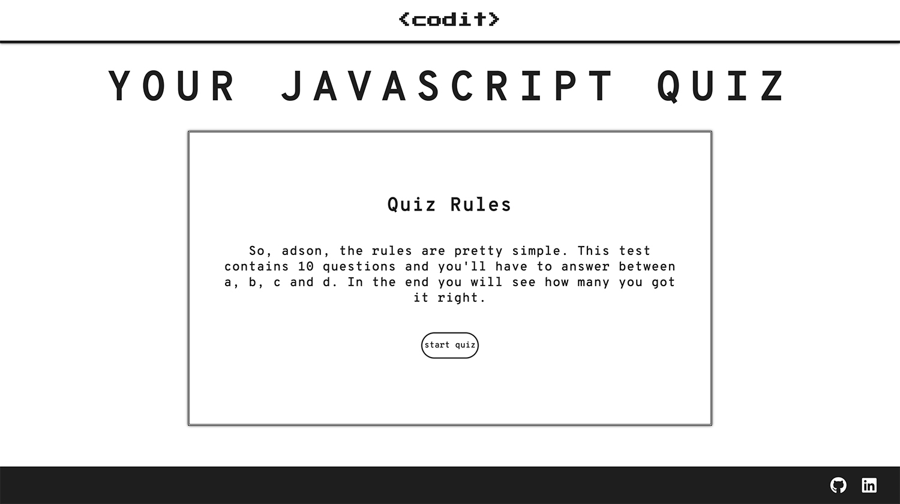

User Name Reuse

 

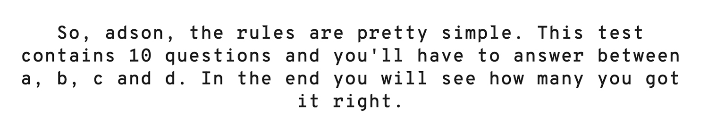

Start Quiz Button Hover Effect

 

### Quiz - Game Interface
- Maintain default design: logo, big title, container style and footer. Concisive design.
- Score box to keep track of the right answer.
- Question counter to know in which question the user is currently on.
- Green response for correct answers.
- Red response for incorrect answers.

Quiz - Game Interface

 

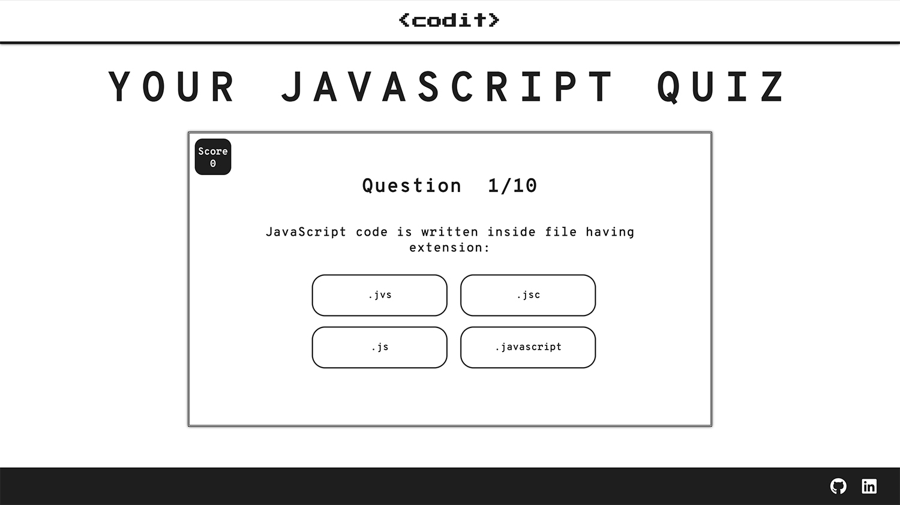

Score Box

 

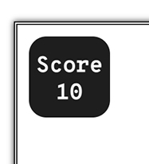

Question Counter

 

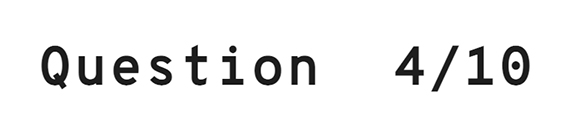

Correct Answer

 

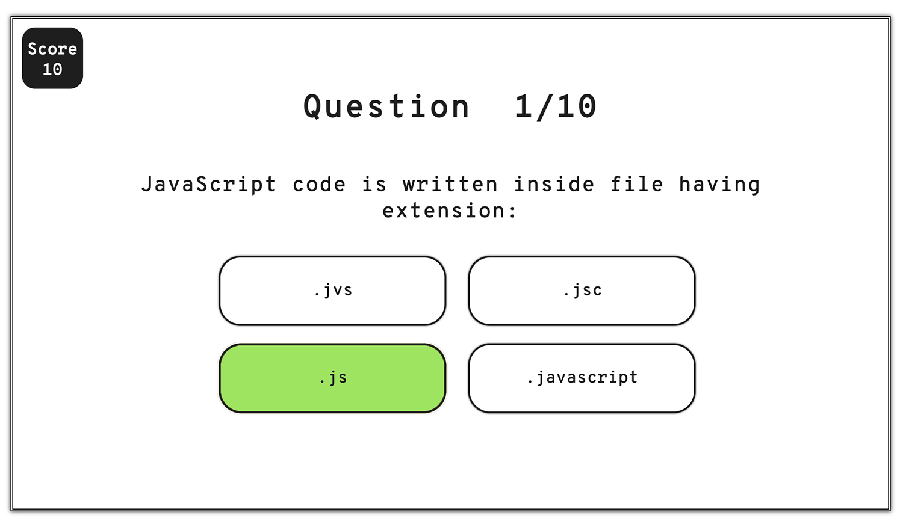

Incorrect Answer

 

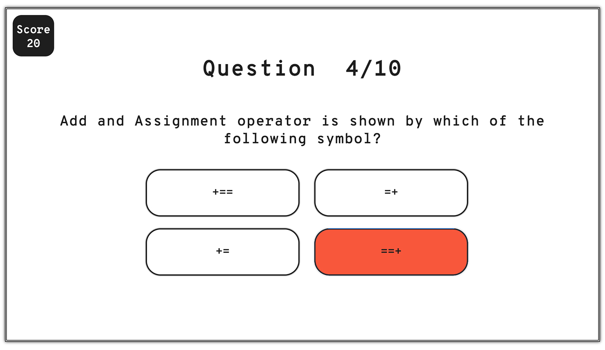

### Quiz - Score Interface
- Maintain default design: logo, big title, container style, button style and footer. Concisive design.
- Showcase user's name.
- Showcase user's final score.
- Restart button hover effect.

Quiz - Score Interface

 

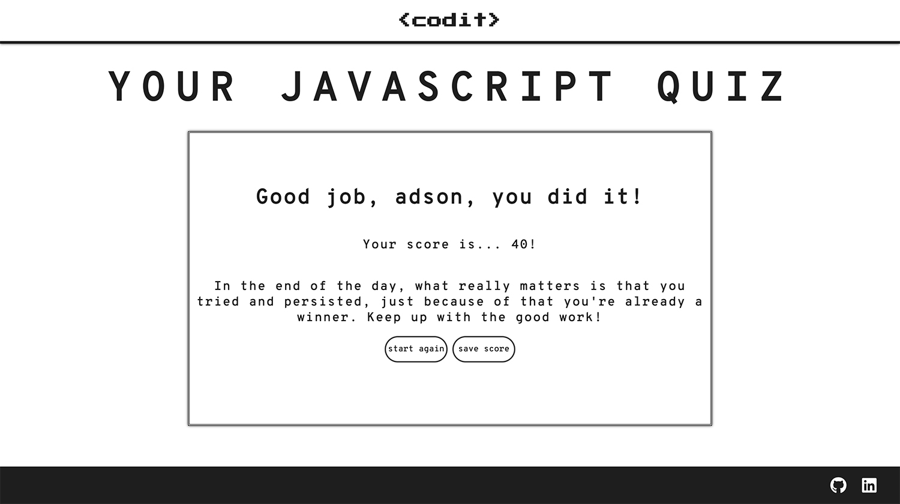

User's Name

 

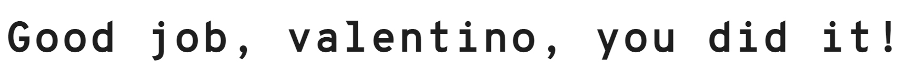

User's Final Score

 

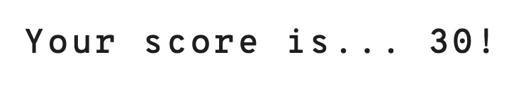

Restart Button Hover Effect

 

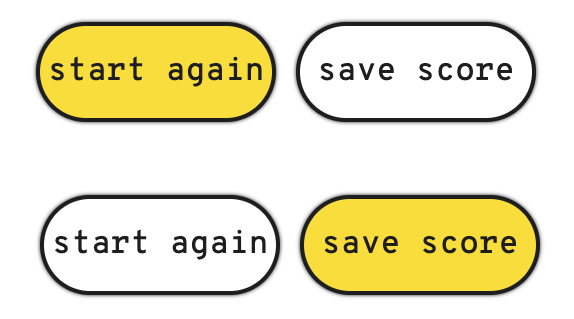

### 404 Error Page
- Maintain default design: logo, big title, container style, button style and footer. Concisive design.
- Back to quiz button hover effect.

404 Error Page

 

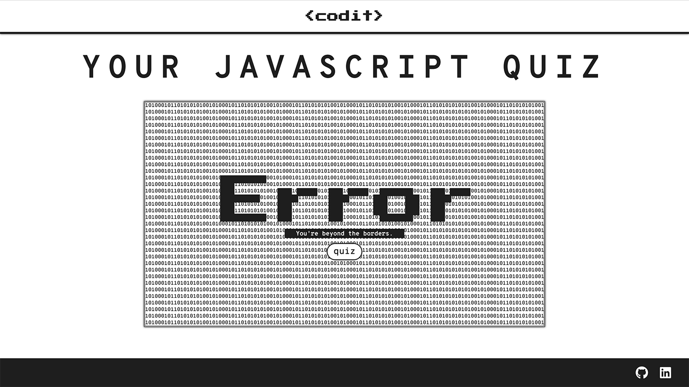

Quiz Button

 

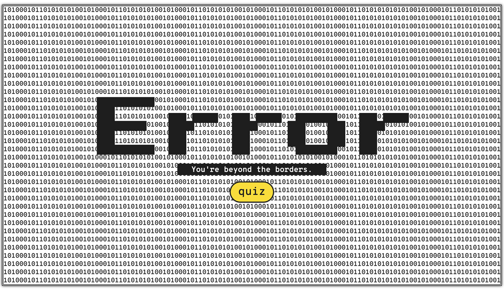

# Technologies Used

### Languages
The following languages were used to develop the website:
- HTML
- CSS
- JavaScript

### Frameworks and Tools
The following frameworks and tools were used to develop the website:
- Git
- Github
- Gitpod
- Favicon
- Devtool
- Balsamiq
- Google Fonts
- Font Awesome
- JSHint Validation
- Adobe Photoshop 2023
- Techsini Mockup Generator
- GitHub Wiki TOC generator
- W3C Markup Validation Service

# Testing

### HTML Validation

The Nu HTML Checker (W3C) is used to validate HTML documents. The files passed without any errors.

index HTML Validation

 

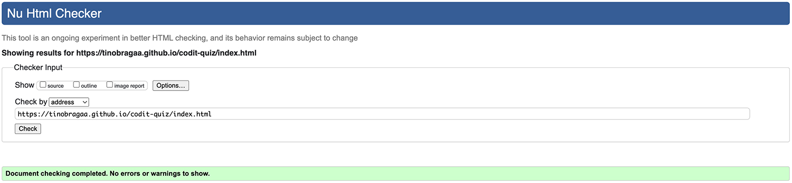

404 Error HTML Validation

 

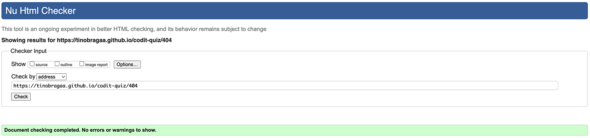

### CSS Validation

The W3C Jigsaw CSS Validation Service is used to validate CSS documents. The file passed without any errors.

### JS Validation

The JSHint is used to validate JavaScript documents. The files passed without any errors.

Main JS Validation

 

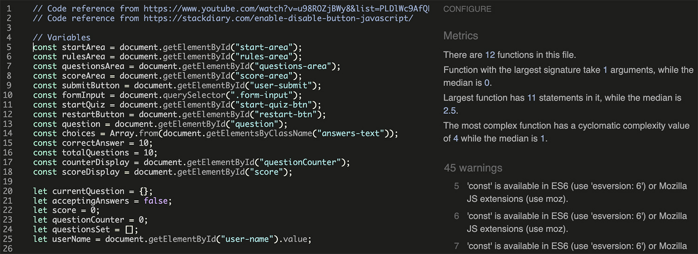

Questions JS Validation

 

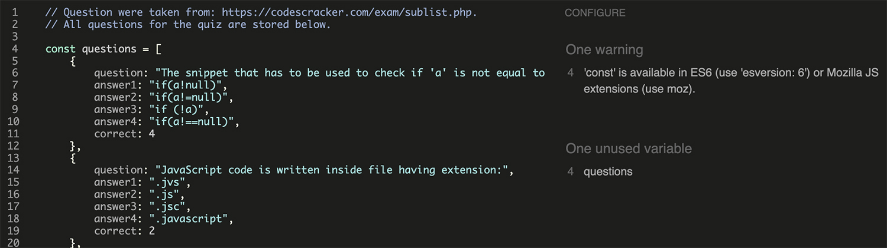

### Lighthouse

Lighthouse testing was carried out to test the performance, accessibility, best practices and SEO of the quiz.

index HTML Lighthouse

 

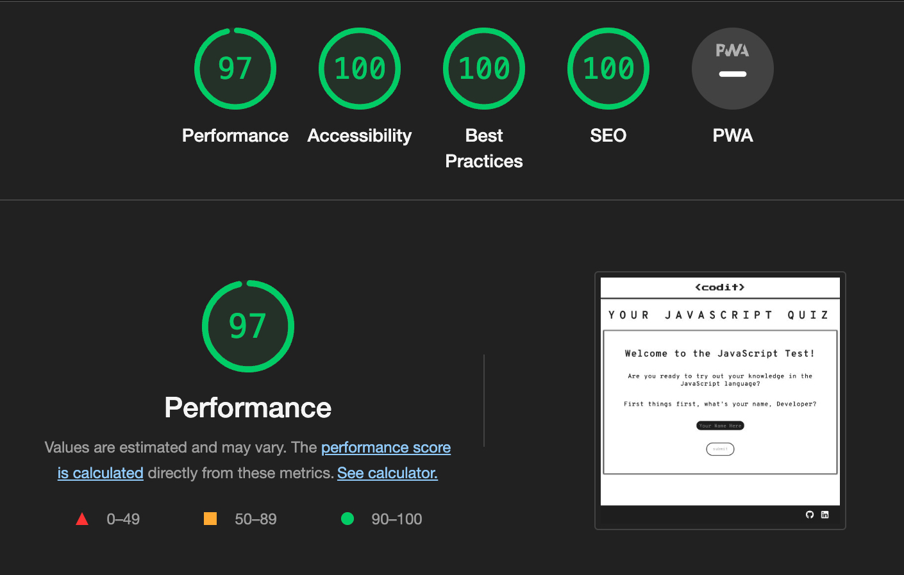

404 Error HTML Validation

 

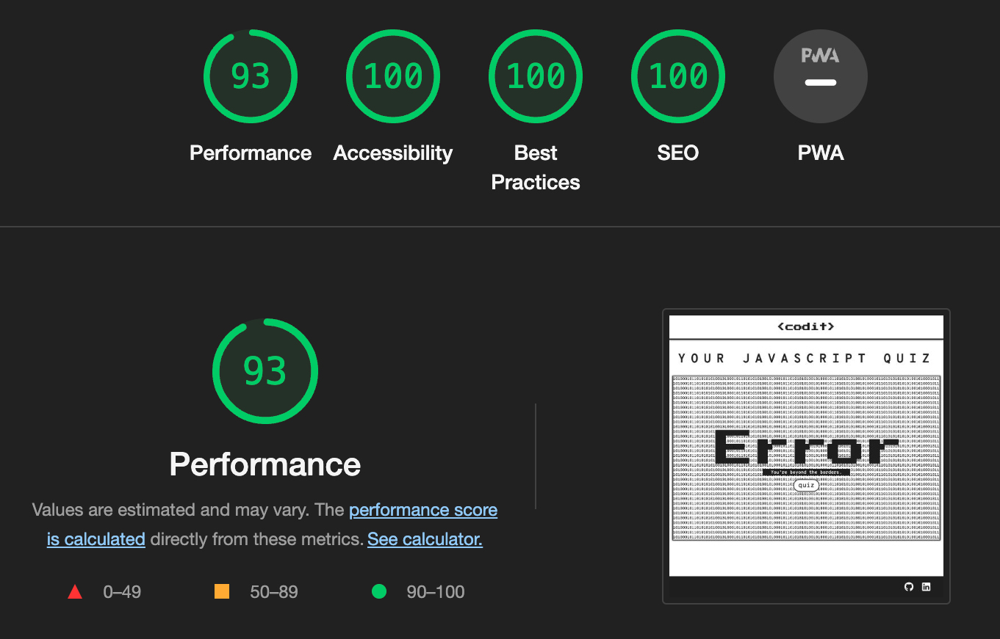

### Accessibility

The WAVE web accessibility evaluation tool by WebAIM was used to ensure the webpages met accessibility standards.

index HTML WAVE

 

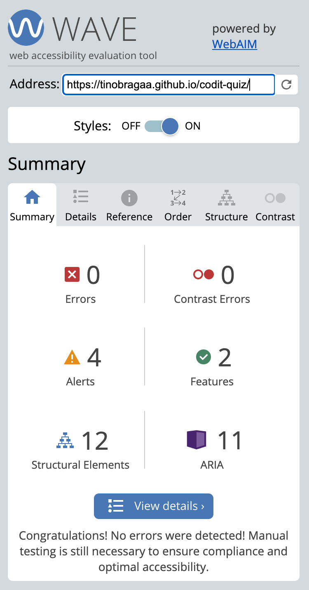

404 Error HTML Validation

 

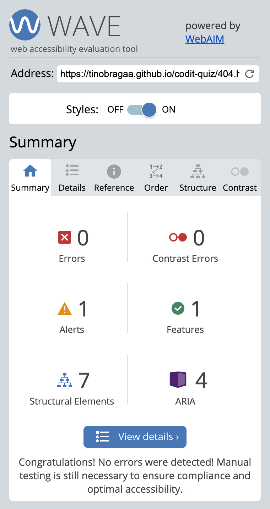

Responsive test on multiple devices.
The following devices were used to ensure the site was responsive:

- Ipad Pro
- Galaxy S20
- Macbook Pro
- Iphone 13 Pro
- Iphone 14 Pro Max
- Notebook Acer Predator Helios 300

# Bugs

Bug: When I wrote the function "getUserName" I couldn't make it work. What I wanted it to do was to take the asked user name in the first interface and use on the second interface. The problem was that it wasn't showing the value inside the ${}, when the function loaded the innet text was displayed but not the content inside the curly braces.

Fix: The solution was the type of event used in the first place. In the HTML file I was using onclick event which was preventing the function to work like needed. The appropriate event is the onblur: it triggers the function once the field loses focus (i.e. the user navigates away from the field).

Bug: Change the background colour of the input type text when auto-filling from the browser.

Fix: I was able to achieve that using the "-webkit-autofill" so whenever the user fills the input field with the browser auto-filling it doesn't change its colour.

Bug: When I tried the quiz on my phone the hover effects were sticky to the buttons. The background colour that was set through the hover effect wouldn't disappear on the touch screen capabilities.

Fix: Added a media querie to disable the hover effect on touch screen devices.

Bug: When I tried the quiz on my phone the text inside the buttons inherit the default colour. I was ecpeting it to be black but it was coming along blue.

Fix: On the CSS part I defined the volor to prevent inherit it from the deafult. 

Bug: I didn't want the label element appearing on the site. However, the wave validation keeps tracking it as an error.

Fix: Reading through the wave website, the appropriate way to do it is using a class .visuallyhidden.

# Deployment

[Click Here To See The Live Website](https://tinobragaa.github.io/codit-quiz/)

### Deploy
The website was deployed through the use of GitHub Pages, a feature built in to GitHub. This can be done by following the steps below.
1. In the desired repository, click on "Settings" from the top menu.
2. From the side menu to your left, select "Pages" in the "Code and automation" section.
3. Make sure the "Source" option is set to "Deploy from a branch"
4. Select the desired "Branch" from the drop down below (main branch in most cases, making sure the director is set to /(root)).
5. Select "Save", and after it refreshes the page, you will see a box at the top of the page providing you with the URL of your now published site.

To contribute or check the code yourself, you can fork or clone the repository as well.

### Fork
1. Go to the desired repository
2. Click "Fork" in the upper right corner
3. Select the owner, and set the repository name. A description can be added if desired
4. Choose whether to copy the default branch, or all branches
5. Click "Create Form"

### Clone

1. Go to the desired repository
2. Click the "Code" button at the top of the files section of the page
3. Select your desired method for cloning (HTTPS/SSH/GitHub CLI)
4. Open Git Bash
5. Change the current working directory to the location where you want the cloned directory
6. Type "git clone", and then paste the URL you copied earlier. It will look like this, with your GitHub username instead of "YOUR-USERNAME": "$ git clone https://github.com/YOUR-USERNAME/DESIRED-REPOSITORY"
7. Press Enter. Your local clone will be created.

# Credits

A list of references and tutorials used for the site:

* [Codepen](https://codepen.io/trending)
* [Quiz Questions](https://codescracker.com/index.htm)
* [Hiding Label Element](https://www.w3.org/WAI/tutorials/forms/labels/)
* [Get Input's Value](https://www.tabnine.com/academy/javascript/get-value-of-input/)
* [Enable/Disable Button Tutorial](https://stackdiary.com/enable-disable-button-javascript/)
* [Quiz Tutorial](https://www.youtube.com/watch?v=u98ROZjBWy8&list=PLDlWc9AfQBfZIkdVaOQXi1tizJeNJipEx)
* [Hover Effect Mobile Devices](http://www.javascriptkit.com/dhtmltutors/sticky-hover-issue-solutions.shtml)
* [Behance/Cobyte](https://www.behance.net/gallery/129975245/Cobyte-brand-identity?tracking_source=search_projects%7Ccoding+design)
* [Browser Input Text Autofill](https://stackoverflow.com/questions/29580704/change-input-background-to-transparent-on-autocomplete-form)
- Love Maths Project

# Acknowledgements

I would like to take this opportunity to acknowledge and thank the following people:

- My actual manager, Saoirse, for letting me study.
- A big thank you for everybody on Code Institute's Slack Channels.
- Jason, tutor from Code Institue. Thank you for the help.
- My sister, Dana Braga, who's always willing to help.
- My loved husband, Adson Aquino, who's always by my side.